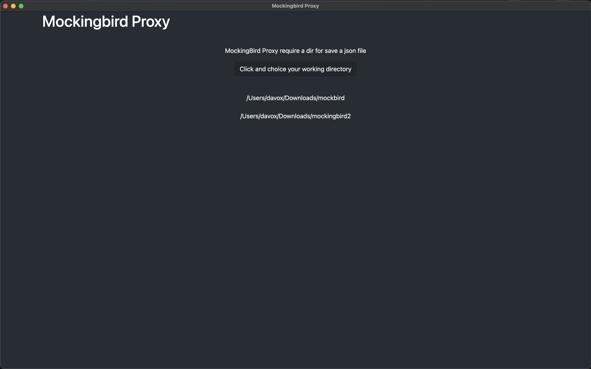
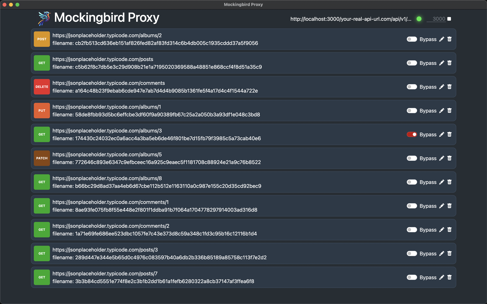
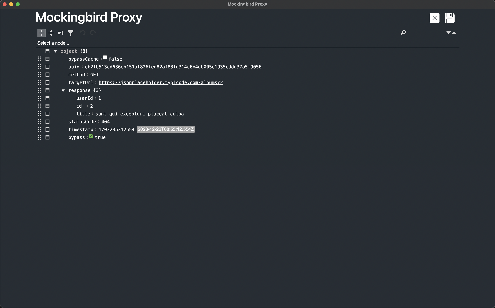

# Mockingbird Proxy

## Introduzione
Mockingbird Proxy è un potente strumento di sviluppo che funge da intermediario tra il tuo frontend/backend e le API esterne, archiviando automaticamente tutte le chiamate API in file JSON.

## Caratteristiche
- **Archiviazione Automatica**: Memorizza tutte le chiamate API.
- **Modifica Risposte**: Personalizza risposte API e status code.
- **Caching**: Accelera il caricamento durante lo sviluppo.
- **Flessibilità**: Passa facilmente dalla cache alle risposte reali.

## Configurazione
- **Porta e Percorso**: Configura la porta e il percorso di salvataggio dei file JSON.
- **Integrazione**: Modifica l'URL in sviluppo per utilizzare il proxy.

## Uso
# Guida all'Uso di Mockingbird-Proxy

**Autore**: [Il Tuo Nome]
**Data**: [Data]

## Introduzione

Mockingbird-Proxy è uno strumento efficace per il mocking delle API durante lo sviluppo di applicazioni. Questa guida ti mostrerà come iniziare a usarlo.

## Avvio dell'Applicazione Mockingbird-Proxy

### Passo 1: Avvio dell'Applicazione

1. Avvia l'applicazione Mockingbird-Proxy.
2. Nel pannello in alto a destra, trova l'opzione per cambiare la porta.
3. Scegli la porta desiderata e avvia il server.

### Passo 2: Configurazione nel Tuo Progetto

Dopo aver avviato il server Mockingbird-Proxy, reindirizza le tue chiamate API attraverso il proxy. 

Ad esempio, cambia: 
`https://il-mio-backend.com/api/v1/blog/posts` 
in: 
`http://localhost:3000/https://il-mio-backend.com/api/v1/blog/posts` 

Aggiungi `http://localhost:3000/` come prefisso all'URL del tuo backend per utilizzare il server di mocking.

---

## Vantaggi
- **Documentazione del Modello Dati**: Utile per archiviare il modello dati delle chiamate API.
- **Eliminazione dei Problemi CORS**: Facilita lo sviluppo evitando problemi di CORS.
- **Compatibilità Estesa**: Supporta vari framework e piattaforme.

## Screenshots

## Contribuire

Apprezziamo ogni contributo a Mockingbird Proxy! Ecco come puoi partecipare:

1. **Fork del Repository**: Visita il [repository GitHub](https://github.com/davoxpa/mockingbird-proxy/) e crea un fork.
2. **Crea una Branch**: Dalla tua fork, crea una nuova branch per le tue modifiche.
3. **Apporta Modifiche**: Implementa le tue idee e correzioni.
4. **Invia una Pull Request**: Una volta testate le modifiche, invia una pull request alla branch principale.
5. **Revisione**: Esamineremo la tua pull request e ti forniremo un feedback.

Ogni contributo, grande o piccolo, è molto apprezzato. Grazie per il tuo supporto!

## Licenza
Apache License 2.0
